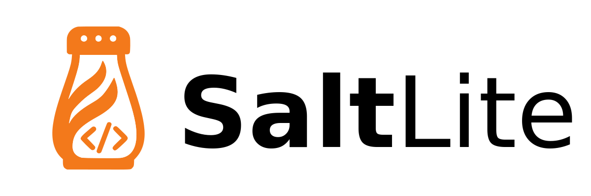

<p align="center"><a href="https://github.com/phoneburner/salt-lite-framework" target="_blank">

</a></p>

# SaltLite Application Skeleton

> Feels like home, just without the salty tears of frustration

The [SaltLite Framework] is a "batteries-included", very-highly-opinionated PHP
framework, derived from the original Salt framework/application used by PhoneBurner.
While modeled on other modern "general purpose" frameworks like Symfony and Laravel,
the SaltLite Framework is designed and optimized as an API backend.

Ideally, it adapts the best core features of Salt without dragging along unnecessary
complexity, technical debt, and the (many) design decisions we regret. The goal is
to provide users with a robust framework with minimum cognitive overhead from the original
Salt framework, avoiding the pitfalls of bringing in a full-fledged third-party
framework and trying to adapt that to our needs.

This is the application skeleton for the SaltLite framework, which is intended to be
used as a template for creating new SaltLite applications.

## Getting Started

### Prerequisites

- GNU Make (usually installed by default on Linux distributions)
- Docker
- Git
- A GitHub Personal Access Token with `repo` scope. The build process will prompt you to enter this token, or it be
  added manually to the .env file.

### Create a New Project from the Skeleton Template

1. To create a new project from the skeleton template, run the following command:

```shell
docker run --rm -it -v $PWD:/app -u -w /app composer/composer create-project \
  --repository='{"type": "github",  "url": "https://github.com/phoneburner/salt-lite-skeleton"}' 
  --stability=dev \
  --ignore-platform-reqs \
  --no-install \
  --ask \
  phoneburner/salt-lite-skeleton
```

2. Navigate to the project directory and initialize a new Git repository:

```shell
cd /path/to/your/project
git init
```

3. Run make to build the Docker image, set up DIST files, and install the dependencies:

```shell
make
```

You can confirm a successful installation by running the following:

```shell
make test
```

By default, the application server will be available at http://localhost:8888,
navigating to this URL should display the Welcome page response page. (Ports mapping
can be configured in the .env file.)

## Component Documentation

See the main [SaltLite Framework] for documentation on the framework components, configuration, and features.

### Command Overview

```shell 
# If you ever need to start fresh, you can run the following:
make clean

# To start the application, run the following:
make up

# To stop the application, run the following:
make down

# Run all tests and coding standards checks required to pass before a pull request can be accepted
make ci

# Run PHPStan to statically analyze the entire codebase
make phpstan

# Run the PHP syntax linter
make lint

# Run the PHP_CodeSniffer code standards linter
make phpcs

# Attempt to auto-fix coding standards issues found by phpcs
make phpbf

# Run Rector with project configuration, without making changes
make rector-dry-run

# Run Rector with the project configuration and apply automated fixes
make rector

# Run PHPUnit tests
make phpunit

# Run the following to see a list of available console commands:
docker compose run --rm -it php salt list
```

## Contributing

See the main project [CONTRIBUTING.md] file for details on how to contribute to this project.

## Security & Vulnerability Reporting

See the main project [SECURITY.md] file for details on how to report security vulnerabilities.

[SaltLite Framework]: https://github.com/phoneburner/salt-lite-framework

[CONTRIBUTING.md]: https://github.com/phoneburner/salt-lite-framework/blob/main/CONTRIBUTING.md

[SECURITY.md]: https://github.com/phoneburner/salt-lite-framework/blob/main/SECURITY.md